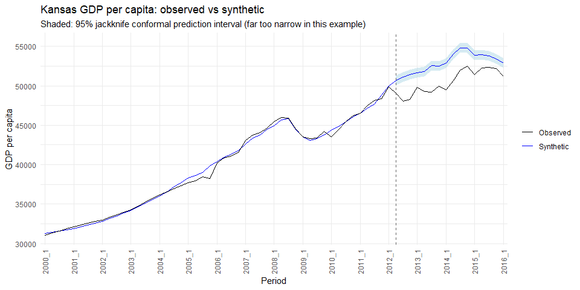
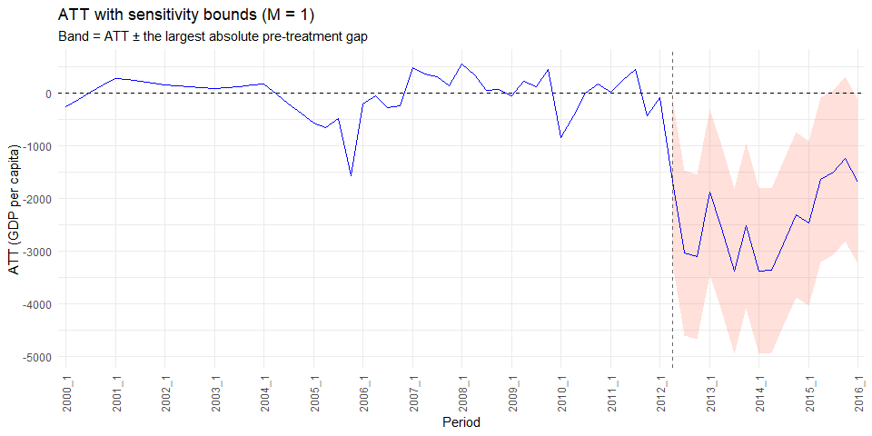
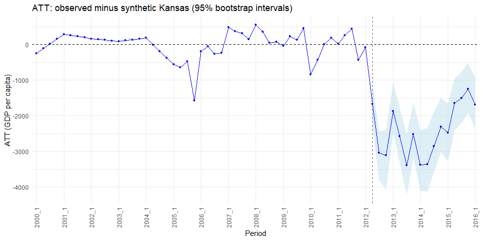
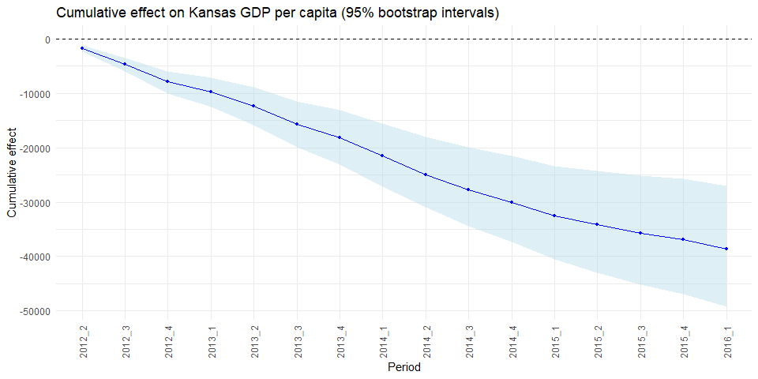

# synth_lasso_boot: LASSO Synthetic Control with Maximum Entropy Bootstrap Inference


> **Disclaimer:** The R functions in this repository, along with this README file, were written by **Claude**, an AI model made by Anthropic, at the direction of the repository owner. They were tested against the owner’s earlier code on the Kansas example, but they have not been independently peer reviewed. Please check the results for your own data and use case before relying on them. As using maximum entropy bootstrapping for inference with synthetic control is largely experimental, this project illustrates what can be accomplished with **Claude** and should not be relied upon for inference in a peer-reviewed paper or policy evaluation.

## Overview

`synth_lasso_boot()` estimates the effect of an intervention on a single treated unit with a **LASSO synthetic control**, and quantifies uncertainty with **maximum entropy bootstrapping** (`meboot`). One call:

1.  **Fits the synthetic control.** A LASSO regression (via **glmnet**) of the treated unit’s pre-treatment outcome on the donor units’ outcomes, plus any control variables. The regression is fit with an intercept by default (`intercept = TRUE`). Coefficients can be constrained (by default to between 0 and 1) and selected columns can be left unpenalized.
2.  **Estimates the effect.** The fitted model predicts the treated unit’s outcome for every period. The gap between observed and predicted is the effect (ATT) for each period, and its running total is the cumulative effect.
3.  **Adds inference on the fit.** Sensitivity bounds based on the worst pre-treatment fit error, and optional jackknife conformal prediction intervals.
4.  **Bootstraps.** The outcome (and controls) for every unit is resampled with maximum entropy bootstrapping, the LASSO is refit on each replicate’s pre-treatment period at the same penalty, and the resulting effects give bootstrap intervals for the per-period and cumulative effects. This approach was inspired by Wong et al. (2023); see [References](#references).

The maximum entropy bootstrap is performed with the **meboot** R package, so `synth_lasso_boot()` requires it to be installed.

## Repository structure

    ├── README.qmd / README.md
    ├── Synthetic_control_functions/
    │   └── synthetic_control_functions_claude.R   # synth_lasso_boot() and its bootstrap helper
    └── Example_cases/
        ├── Synth_lasso_boot_example.R             # full Kansas example with synth_lasso_boot()
        └── Kansas_meboot_multi_example.R          # the bootstrap step on its own

The functions are all in one file: `synth_lasso_boot()` and the helper it uses to run `meboot` across many units and variables. The scripts in `Example_cases/` work through the Kansas example; run them from the project root.

## Installation

The functions are plain R scripts; there is no package to install.

``` r
# glmnet fits the LASSO; meboot performs the maximum entropy bootstrap
install.packages(c("glmnet", "meboot", "tidyr", "tidyselect"))

# Only needed for jackknife conformal intervals
remotes::install_github("ryantibs/conformal", subdir = "conformalInference")

# Only needed for the Kansas example data
remotes::install_github("ebenmichael/augsynth")
```

``` r
source("Synthetic_control_functions/synthetic_control_functions_claude.R")
```

## Quick start

``` r
res <- synth_lasso_boot(
  data             = kansas,          # long format: one row per unit and period
  unit_col         = "state",
  time_cols        = c("year", "qtr"),
  outcome_col      = "gdpcapita",
  treated_unit     = "Kansas",
  treatment_period = c(year = 2012, qtr = 2),   # first treated period
  seed             = 12112025
)

res$effects    # observed, predicted, effects, bounds and intervals by period
res$weights    # donor weights
```

## Arguments

### Data

| Argument | Default | Description |
|----|----|----|
| `data` | *required* | Long-format data frame: one row per unit and period. |
| `unit_col` | *required* | Column holding unit names, e.g. `"state"`. |
| `time_cols` | *required* | Column(s) that order time, e.g. `c("year", "qtr")`. Periods are sorted and numbered 1, 2, …; that number is `rowid` in the output. |
| `outcome_col` | *required* | Outcome column, e.g. `"gdpcapita"`. Must be numeric with no missing values. |
| `treated_unit` | *required* | Name of the treated unit, e.g. `"Kansas"`. |
| `treatment_period` | *required* | The **first post-treatment period**, given as the value(s) of `time_cols` in that period, e.g. `c(year = 2013)` or `c(year = 2012, qtr = 2)`. See below. |

The panel must be balanced: every unit needs every period.

#### Specifying the treatment period

`treatment_period` is the first treated period, written in the same terms as your time columns, with one value for each column in `time_cols`:

``` r
# One time column: the first treated year
time_cols = "year", treatment_period = c(year = 2013)     # or just 2013

# Several time columns: the first treated year and quarter
time_cols = c("year", "qtr"), treatment_period = c(year = 2012, qtr = 2)
                                                         # or c(2012, 2)
```

Named values are matched to `time_cols` by name; unnamed values are taken in the order of `time_cols`. Each value must match a period in the data exactly (a `list()` can hold other types, such as a `Date`). Every period before it is pre-treatment, and it and every later period are post-treatment, shown by the logical `post` column in the output. At least two pre-treatment periods are required.

### Control variables

| Argument | Default | Description |
|----|----|----|
| `controls` | `NULL` | Extra numeric columns to use as predictors, e.g. `c("popestimate")`. Each is pivoted wide and enters the LASSO as `<control>_<unit>` columns (e.g. `popestimate_Texas`). Controls are bootstrapped along with the outcome. |
| `control_units` | `"all"` | Whose control series enter the model: `"all"`, `"donors"`, or `"treated"`. |

The treated unit’s own controls after treatment may themselves be affected by the treatment, which would bias the synthetic control. `control_units = "donors"` avoids this.

### LASSO fit

| Argument | Default | Description |
|----|----|----|
| `intercept` | `TRUE` | Fit the LASSO with an intercept (on by default). The intercept is not penalized and is not subject to `lower_constr` / `upper_constr`. Set `FALSE` to fit without one. |
| `lower_constr` | `0` | Lower coefficient limit(s). One number applies to every donor. A vector can hold one **unnamed** donor default plus **named** values for individual columns, e.g. `c(0, Texas = -0.2)`. glmnet requires every lower limit to be ≤ 0. |
| `upper_constr` | `1` | Upper coefficient limit(s), same format, e.g. `c(1, popestimate_Kansas = 0.01)`. glmnet requires every upper limit to be ≥ 0. |
| `control_lower` | `-Inf` | Default lower limit for control columns. Named entries in `lower_constr` override it. |
| `control_upper` | `Inf` | Default upper limit for control columns. Named entries in `upper_constr` override it. |
| `unpenalized` | `NULL` | Predictor columns that are not penalized, so they always stay in the model, e.g. `"Colorado"` or `"popestimate_Kansas"`. Their limits still apply. |
| `standardize` | `FALSE` | Passed to glmnet. `TRUE` standardizes **every** predictor, donors included, which changes the donor weights even without controls. |
| `scale_controls` | `FALSE` | `TRUE` rescales only the control columns so their pre-treatment standard deviation matches the average pre-treatment standard deviation of the donors. Donors are untouched, and coefficients and limits stay in original units. Ignored, with a warning, when `standardize = TRUE`. |
| `nlambda` | `1000` | Length of the lambda path for cross-validation. |
| `lambda_choice` | `"min_path"` | Penalty used for predictions, weights and the bootstrap refits: `"min_path"` (smallest lambda on the path), `"lambda.min"` (lowest cross-validated error), or `"lambda.1se"` (largest lambda within one standard error of the minimum). |
| `seed` | *required* | Seed for the cross-validation folds. |

**Why `scale_controls` matters.** Donor weights are kept on the outcome’s scale (`standardize = FALSE`). A control on a much larger scale, such as population in people, gets a tiny coefficient that the penalty barely touches, so it can crowd out the donors. `scale_controls = TRUE` puts the controls on the donors’ scale without changing how the donors are fit.

**About `"min_path"`.** The smallest lambda on the path is set by the path itself, not by cross-validation, so the seed does not change the predictions under this setting. Use `"lambda.min"` or `"lambda.1se"` to let cross-validation choose the penalty.

### Inference on the observed fit

| Argument | Default | Description |
|----|----|----|
| `M` | `1` | Sensitivity-bound multiplier (see [Sensitivity bounds](#sensitivity-bounds)). |
| `jack_conform` | `FALSE` | `TRUE` adds jackknife conformal prediction intervals for the post-treatment predictions (see [Jackknife conformal prediction intervals](#jackknife-conformal-prediction-intervals)). |
| `conform_level` | `0.95` | Coverage of the conformal intervals. |

### Bootstrap

| Argument | Default | Description |
|----|----|----|
| `boot` | `TRUE` | Run the bootstrap. `FALSE` returns only the observed fit. |
| `reps` | `1000` | Number of bootstrap replicates. |
| `trim` | `list(trim = 0.10, xmin = NULL, xmax = NULL)` | meboot `trim`/`xmin`/`xmax`. One list for every bootstrapped variable, or a list named by variable, e.g. `list(gdpcapita = list(xmin = 15000), popestimate = list(xmin = 450000))`. |
| `boot_by_unit` | `FALSE` | `FALSE` bootstraps each variable as one stacked series across all units, in the row order of `data`. `TRUE` bootstraps each unit’s series separately, so each unit keeps its own time dependence. |
| `boot_nlambda` | `100` | Lambda path length for the bootstrap refits. |
| `conf_int` | `0.95` | Level of the bootstrap effect and cumulative-effect intervals. |
| `boot_seed` | `seed` | Seed for the bootstrap. |
| `keep_boot` | `FALSE` | `TRUE` also returns the bootstrap replicates (can be large). |
| `...` |  | Further arguments passed to `meboot::meboot()`, e.g. `reachbnd`, `expand.sd`, `force.clt`. |

**Choosing `xmin`.** meboot stretches the lower tail of each series down to `xmin`. With `xmin = 0`, some draws can fall far below any observed value. Set it to a plausible floor for the variable instead.

## Output

`synth_lasso_boot()` returns a list:

| Element | Contents |
|----|----|
| `effects` | One row per period (columns below). |
| `fit_stats` | Minimum cross-validated MSE, the lambda used, the pre-treatment MSE of the fit, and the sensitivity bound. |
| `weights` | Non-zero coefficients at the lambda used, in original units, with `Type` (intercept, donor, control) and `Unpenalized`. |
| `model` | The fitted `cv.glmnet` object. |
| `boot` | `effects` and `cum_effects` matrices (post-treatment periods × replicates), plus `replicates` if `keep_boot = TRUE`. `NULL` when `boot = FALSE`. |
| `settings` | The settings used, including `predictors`: each predictor’s limits, penalty factor and scale factor. |

Columns of `effects`:

| Column | Description |
|----|----|
| `rowid`, time columns, `period` | Period number, the original time columns, and a label such as `"2012_2"`. |
| `post` | `TRUE` from the first treated period on, `FALSE` before it. |
| `treated_observed` | Observed outcome for the treated unit. |
| `treated_predicted` | Synthetic control prediction. |
| `att`, `att_post` | Observed minus predicted, for all periods and for post-treatment only. |
| `cum_att` | Running total of the post-treatment ATT. |
| `bounds_lo`, `bounds_hi` | Sensitivity bounds on the ATT. |
| `pred_jack_lo`, `pred_jack_hi` | Jackknife conformal prediction interval for `treated_predicted` (only if `jack_conform = TRUE`). |
| `eff_low`, `eff_high`, `average_eff` | Bootstrap interval and mean of the per-period effect. |
| `cum_eff_low`, `cum_eff_high`, `average_cum_effect` | Bootstrap interval and mean of the cumulative effect. |
| `treated_unit` | Name of the treated unit. |

Inference columns are `NA` in the pre-treatment period.

## Methods

### Sensitivity bounds

The sensitivity bounds benchmark the estimated effects against how well the synthetic control fit **before** treatment. The function finds the largest absolute gap between the observed and predicted outcome in the pre-treatment period:

$$
B = M \times \max_{t < T_0} \left| Y_t - \hat{Y}_t \right|
$$

where $T_0$ is the first treated period (`treatment_period`). For each post-treatment period the ATT is then shown with a band of $\pm B$:

- `bounds_lo = att - B`
- `bounds_hi = att + B`

The question the bounds answer is: *could this post-treatment gap be produced by fit error of the size already seen before treatment?* If the band excludes zero, the estimated effect is larger than the worst pre-treatment miss, so fit error alone of that size cannot explain it. If the band includes zero, an error as large as the model has already made could account for the gap.

`M` scales the benchmark. `M = 1` uses the worst pre-treatment miss as is. `M = 2` asks whether the effect survives even if post-treatment fit error were twice as large as the worst pre-treatment miss. `M = 0.5` is less demanding. For each post-treatment period, the value of `M` at which the band first touches zero is $|ATT_t| \,/\, \max_{t < T_0} |Y_t - \hat{Y}_t|$; the example below reports it.

The bounds are a benchmark rather than a confidence interval: they carry no probability statement.

### Jackknife conformal prediction intervals

With `jack_conform = TRUE`, the function builds a prediction interval around each post-treatment prediction of the treated unit:

1.  Each pre-treatment period is left out in turn, the LASSO is refit on the remaining periods at the same penalty, and the left-out period is predicted.
2.  The absolute leave-one-out residuals measure out-of-sample prediction error.
3.  The interval for each post-treatment period is the full-model prediction plus or minus the `conform_level` quantile of those residuals.

`pred_jack_lo` and `pred_jack_hi` are therefore intervals for the **counterfactual outcome** (what the treated unit would have been without treatment), not for the effect. If the observed outcome falls outside the interval, it is unusual relative to the model’s out-of-sample error. The method treats the pre-treatment periods as exchangeable, which time series data may not satisfy, so read the coverage as approximate. In the Kansas example below the intervals come out far too small; see the note after the jackknife table.

### Maximum entropy bootstrap

The bootstrap effect and cumulative-effect intervals were inspired by the approach of Wong et al. (2023), who used LASSO regression to estimate the population-level impact of pneumococcal conjugate vaccines.

The bootstrap resamples each variable with `meboot()` from the **meboot** package, which keeps the rank order of the original series and draws new values close to the observed ones, so trends and time dependence are preserved. For each replicate:

1.  The LASSO is refit on the bootstrapped pre-treatment period, at the penalty chosen on the observed data.
2.  The refit model predicts the bootstrapped post-treatment period.
3.  The effect is the **observed** post-treatment outcome minus that prediction; its running total is the cumulative effect.

The `conf_int` quantiles across replicates give `eff_low`/`eff_high` and `cum_eff_low`/`cum_eff_high`.

With `boot_by_unit = FALSE`, each variable is bootstrapped as one long series across all units, so a unit’s draws depend on where its values fall among the other units’ values. `boot_by_unit = TRUE` resamples each unit’s own history.

## Example: Kansas GDP per capita

This example uses the **Kansas tax experiment**. In 2012, Kansas passed large income tax cuts, and the example estimates their effect on GDP per capita, using the other 49 states as donors and treating 2012 Q2 as the first treated quarter (`treatment_period = c(year = 2012, qtr = 2)`). An annual version with a single time column (`time_cols = "year"`, `treatment_period = c(year = 2013)`) is in `Example_cases/Synth_lasso_boot_example.R`.

The data come from the **augsynth** R package, which includes the `kansas` dataset: a quarterly panel of the 50 US states from 1990 Q1 to 2016 Q1.

### Setup

``` r
library(augsynth)
library(tidyverse)
library(glmnet)
library(meboot)

source("Synthetic_control_functions/synthetic_control_functions_claude.R")

# Lower for quick test renders
n_reps <- 1000
```

### Data

Load the `kansas` dataset from **augsynth** (loaded in the setup chunk):

``` r
data("kansas")

kansas |>
  select(state, year, qtr, gdpcapita, popestimate) |>
  head() |>
  knitr::kable()
```

| state   | year | qtr | gdpcapita | popestimate |
|:--------|-----:|----:|----------:|------------:|
| Alabama | 1990 |   1 |  17681.24 |     4050055 |
| Alabama | 1990 |   2 |  17900.62 |     4062330 |
| Alabama | 1990 |   3 |  18118.69 |     4074606 |
| Alabama | 1990 |   4 |  18335.44 |     4086881 |
| Alabama | 1991 |   1 |  18550.89 |     4099156 |
| Alabama | 1991 |   2 |  18806.15 |     4112871 |

### Model 1: outcome only, with jackknife intervals

``` r
kansas_m1 <- synth_lasso_boot(
  data             = kansas,
  unit_col         = "state",
  time_cols        = c("year", "qtr"),
  outcome_col      = "gdpcapita",
  treated_unit     = "Kansas",
  treatment_period = c(year = 2012, qtr = 2),
  seed             = 12112025,
  M                = 1,
  jack_conform     = TRUE,
  conform_level    = 0.95,
  reps             = n_reps,
  trim             = list(trim = 0.10, xmin = 15000),
  conf_int         = 0.95
)
```

Fit statistics and donor weights:

``` r
knitr::kable(kansas_m1$fit_stats, digits = 2)
```

| Name           |     Stats |
|:---------------|----------:|
| CV MSE (min)   | 128565.33 |
| Lambda used    |  13568.67 |
| Pre-period MSE |  85330.40 |
| M bound        |   1567.75 |

``` r
knitr::kable(kansas_m1$weights, digits = 4)
```

| Unit           |   Weights | Type      | Unpenalized |
|:---------------|----------:|:----------|:------------|
| (Intercept)    | 3009.1048 | intercept | FALSE       |
| Texas          |    0.1891 | donor     | FALSE       |
| North Dakota   |    0.1666 | donor     | FALSE       |
| Washington     |    0.1154 | donor     | FALSE       |
| Mississippi    |    0.0631 | donor     | FALSE       |
| Connecticut    |    0.0562 | donor     | FALSE       |
| Colorado       |    0.0543 | donor     | FALSE       |
| Indiana        |    0.0524 | donor     | FALSE       |
| Pennsylvania   |    0.0486 | donor     | FALSE       |
| Wyoming        |    0.0260 | donor     | FALSE       |
| Delaware       |    0.0210 | donor     | FALSE       |
| Massachusetts  |    0.0130 | donor     | FALSE       |
| North Carolina |    0.0114 | donor     | FALSE       |
| Utah           |    0.0101 | donor     | FALSE       |
| Nebraska       |    0.0013 | donor     | FALSE       |

#### Jackknife conformal prediction intervals

Observed Kansas against the synthetic prediction and its 95% jackknife prediction interval, for the post-treatment quarters:

``` r
kansas_m1$effects |>
  filter(post) |>
  mutate(outside_interval = treated_observed < pred_jack_lo |
                            treated_observed > pred_jack_hi) |>
  select(period, treated_observed, treated_predicted,
         pred_jack_lo, pred_jack_hi, outside_interval) |>
  knitr::kable(digits = 0)
```

| period | treated_observed | treated_predicted | pred_jack_lo | pred_jack_hi | outside_interval |
|:---|---:|---:|---:|---:|:---|
| 2012_2 | 49016 | 50693 | 50451 | 50935 | TRUE |
| 2012_3 | 48075 | 51111 | 50869 | 51353 | TRUE |
| 2012_4 | 48290 | 51401 | 51159 | 51643 | TRUE |
| 2013_1 | 49799 | 51676 | 51434 | 51917 | TRUE |
| 2013_2 | 49247 | 51819 | 51577 | 52061 | TRUE |
| 2013_3 | 49199 | 52584 | 52342 | 52826 | TRUE |
| 2013_4 | 49969 | 52481 | 52239 | 52723 | TRUE |
| 2014_1 | 49475 | 52857 | 52615 | 53099 | TRUE |
| 2014_2 | 50685 | 54053 | 53811 | 54295 | TRUE |
| 2014_3 | 51945 | 54799 | 54557 | 55041 | TRUE |
| 2014_4 | 52526 | 54833 | 54591 | 55075 | TRUE |
| 2015_1 | 51421 | 53893 | 53651 | 54135 | TRUE |
| 2015_2 | 52291 | 53935 | 53693 | 54177 | TRUE |
| 2015_3 | 52316 | 53822 | 53580 | 54064 | TRUE |
| 2015_4 | 52183 | 53426 | 53185 | 53668 | TRUE |
| 2016_1 | 51218 | 52900 | 52658 | 53142 | TRUE |

> **Note: in this example the jackknife prediction intervals are far too small.** They are much narrower than the bootstrap intervals and the sensitivity band (compare the average widths below), and they should not be read as a realistic range for the counterfactual. Three things shrink them:
>
> 1.  Consecutive quarters are highly correlated, so leaving one quarter out barely changes the fit. The leave-one-out residuals are therefore much smaller than genuine forecast errors.
> 2.  With 49 donor states and a small penalty, the LASSO fits the pre-treatment quarters very closely.
> 3.  The interval has the same width in every post-treatment quarter, even though prediction error should grow the further the forecast runs past
>     2012. 
>
> For the same reasons, `outside_interval = TRUE` is not reliable evidence of an effect here. The bootstrap intervals and the sensitivity bounds give a more realistic picture of the uncertainty.

Average width of each interval over the post-treatment quarters:

``` r
kansas_m1$effects |>
  filter(post) |>
  summarise(
    `Jackknife prediction interval` = mean(pred_jack_hi - pred_jack_lo),
    `Bootstrap effect interval`     = mean(eff_high - eff_low),
    `Sensitivity band (M = 1)`      = mean(bounds_hi - bounds_lo)
  ) |>
  pivot_longer(everything(), names_to = "Interval", values_to = "Average width") |>
  knitr::kable(digits = 0)
```

| Interval                      | Average width |
|:------------------------------|--------------:|
| Jackknife prediction interval |           484 |
| Bootstrap effect interval     |          1523 |
| Sensitivity band (M = 1)      |          3136 |

#### Sensitivity bounds

The ATT with its sensitivity bounds at `M = 1`, and the value of `M` at which each quarter’s band would first include zero:

``` r
max_pre_gap <- kansas_m1$effects |>
  filter(!post) |>
  summarise(max(abs(att))) |>
  pull()

kansas_m1$effects |>
  filter(post) |>
  mutate(M_breakdown = abs(att) / max_pre_gap) |>
  select(period, att, bounds_lo, bounds_hi, M_breakdown) |>
  knitr::kable(digits = 2)
```

| period |      att | bounds_lo | bounds_hi | M_breakdown |
|:-------|---------:|----------:|----------:|------------:|
| 2012_2 | -1676.89 |  -3244.65 |   -109.14 |        1.07 |
| 2012_3 | -3036.55 |  -4604.30 |  -1468.79 |        1.94 |
| 2012_4 | -3111.41 |  -4679.16 |  -1543.65 |        1.98 |
| 2013_1 | -1876.03 |  -3443.79 |   -308.28 |        1.20 |
| 2013_2 | -2572.10 |  -4139.86 |  -1004.35 |        1.64 |
| 2013_3 | -3384.45 |  -4952.20 |  -1816.69 |        2.16 |
| 2013_4 | -2511.85 |  -4079.60 |   -944.10 |        1.60 |
| 2014_1 | -3381.91 |  -4949.67 |  -1814.16 |        2.16 |
| 2014_2 | -3368.39 |  -4936.14 |  -1800.63 |        2.15 |
| 2014_3 | -2854.51 |  -4422.27 |  -1286.76 |        1.82 |
| 2014_4 | -2307.18 |  -3874.94 |   -739.43 |        1.47 |
| 2015_1 | -2471.78 |  -4039.53 |   -904.02 |        1.58 |
| 2015_2 | -1643.86 |  -3211.61 |    -76.10 |        1.05 |
| 2015_3 | -1505.87 |  -3073.62 |     61.88 |        0.96 |
| 2015_4 | -1243.38 |  -2811.13 |    324.37 |        0.79 |
| 2016_1 | -1682.55 |  -3250.31 |   -114.80 |        1.07 |

Largest absolute pre-treatment gap between observed and predicted: 1568.

#### Bootstrap effect and cumulative-effect intervals

``` r
kansas_m1$effects |>
  filter(post) |>
  select(period, att, eff_low, eff_high,
         cum_att, cum_eff_low, cum_eff_high) |>
  knitr::kable(digits = 0)
```

| period |   att | eff_low | eff_high | cum_att | cum_eff_low | cum_eff_high |
|:-------|------:|--------:|---------:|--------:|------------:|-------------:|
| 2012_2 | -1677 |   -2277 |    -1112 |   -1677 |       -2277 |        -1112 |
| 2012_3 | -3037 |   -3780 |    -2439 |   -4713 |       -6001 |        -3543 |
| 2012_4 | -3111 |   -4072 |    -2390 |   -7825 |       -9997 |        -5999 |
| 2013_1 | -1876 |   -2449 |    -1068 |   -9701 |      -12457 |        -7059 |
| 2013_2 | -2572 |   -3316 |    -1781 |  -12273 |      -15787 |        -8881 |
| 2013_3 | -3384 |   -4222 |    -2511 |  -15657 |      -19971 |       -11400 |
| 2013_4 | -2512 |   -3182 |    -1636 |  -18169 |      -23050 |       -13022 |
| 2014_1 | -3382 |   -4101 |    -2411 |  -21551 |      -27101 |       -15488 |
| 2014_2 | -3368 |   -4121 |    -2333 |  -24920 |      -30982 |       -17975 |
| 2014_3 | -2855 |   -3592 |    -1889 |  -27774 |      -34476 |       -19910 |
| 2014_4 | -2307 |   -3004 |    -1500 |  -30081 |      -37390 |       -21472 |
| 2015_1 | -2472 |   -3275 |    -1663 |  -32553 |      -40533 |       -23332 |
| 2015_2 | -1644 |   -2414 |     -949 |  -34197 |      -42989 |       -24329 |
| 2015_3 | -1506 |   -2188 |     -768 |  -35703 |      -45156 |       -25183 |
| 2015_4 | -1243 |   -1920 |     -512 |  -36946 |      -46945 |       -25718 |
| 2016_1 | -1683 |   -2365 |     -943 |  -38629 |      -49254 |       -26993 |

### Model 2: population as a control

Donor-state population is added as a control and rescaled to the donors’ scale. Colorado is kept in the model without a penalty, cross-validation chooses the penalty, and each state is bootstrapped separately.

``` r
kansas_m2 <- synth_lasso_boot(
  data             = kansas,
  unit_col         = "state",
  time_cols        = c("year", "qtr"),
  outcome_col      = "gdpcapita",
  treated_unit     = "Kansas",
  treatment_period = c(year = 2012, qtr = 2),
  controls         = "popestimate",
  control_units    = "donors",
  scale_controls   = TRUE,
  lower_constr     = 0,
  upper_constr     = 1,
  unpenalized      = "Colorado",
  lambda_choice    = "lambda.min",
  seed             = 12112025,
  M                = 1,
  jack_conform     = TRUE,
  reps             = n_reps,
  trim             = list(gdpcapita   = list(trim = 0.10, xmin = 15000),
                          popestimate = list(trim = 0.10, xmin = 450000)),
  boot_by_unit     = TRUE,
  conf_int         = 0.95
)

knitr::kable(kansas_m2$fit_stats, digits = 2)
```

| Name           |    Stats |
|:---------------|---------:|
| CV MSE (min)   | 159252.7 |
| Lambda used    | 221533.7 |
| Pre-period MSE | 134036.3 |
| M bound        |   1308.5 |

``` r
knitr::kable(kansas_m2$weights, digits = 4)
```

| Unit                     |     Weights | Type      | Unpenalized |
|:-------------------------|------------:|:----------|:------------|
| Colorado                 |      0.5097 | donor     | TRUE        |
| North Dakota             |      0.1605 | donor     | FALSE       |
| Wyoming                  |      0.0710 | donor     | FALSE       |
| popestimate_North Dakota |      0.0262 | control   | FALSE       |
| Alaska                   |      0.0194 | donor     | FALSE       |
| popestimate_Michigan     |     -0.0001 | control   | FALSE       |
| (Intercept)              | -12202.4359 | intercept | FALSE       |

Post-treatment rows with jackknife intervals, sensitivity bounds and bootstrap intervals:

``` r
kansas_m2$effects |>
  filter(post) |>
  select(period, treated_observed, treated_predicted, pred_jack_lo, pred_jack_hi,
         att, bounds_lo, bounds_hi, eff_low, eff_high) |>
  knitr::kable(digits = 0)
```

| period | treated_observed | treated_predicted | pred_jack_lo | pred_jack_hi | att | bounds_lo | bounds_hi | eff_low | eff_high |
|:---|---:|---:|---:|---:|---:|---:|---:|---:|---:|
| 2012_2 | 49016 | 50505 | 50338 | 50673 | -1489 | -2797 | -180 | -2642 | 2447 |
| 2012_3 | 48075 | 50748 | 50580 | 50916 | -2673 | -3982 | -1365 | -4614 | 1190 |
| 2012_4 | 48290 | 51240 | 51073 | 51408 | -2950 | -4259 | -1642 | -5423 | 1262 |
| 2013_1 | 49799 | 51698 | 51531 | 51866 | -1899 | -3207 | -590 | -3520 | 2378 |
| 2013_2 | 49247 | 51835 | 51667 | 52002 | -2588 | -3897 | -1280 | -4559 | 1686 |
| 2013_3 | 49199 | 52646 | 52479 | 52814 | -3447 | -4755 | -2138 | -5483 | 1027 |
| 2013_4 | 49969 | 52721 | 52554 | 52889 | -2752 | -4061 | -1444 | -4731 | 1890 |
| 2014_1 | 49475 | 53314 | 53147 | 53482 | -3839 | -5148 | -2531 | -6032 | 1227 |
| 2014_2 | 50685 | 54607 | 54440 | 54775 | -3923 | -5231 | -2614 | -5780 | 1751 |
| 2014_3 | 51945 | 55402 | 55234 | 55570 | -3458 | -4766 | -2149 | -5354 | 2415 |
| 2014_4 | 52526 | 55667 | 55499 | 55835 | -3141 | -4450 | -1833 | -5397 | 2806 |
| 2015_1 | 51421 | 54343 | 54175 | 54511 | -2922 | -4231 | -1614 | -5277 | 2682 |
| 2015_2 | 52291 | 54342 | 54174 | 54509 | -2050 | -3359 | -742 | -5174 | 3090 |
| 2015_3 | 52316 | 54131 | 53963 | 54299 | -1815 | -3124 | -507 | -4948 | 3536 |
| 2015_4 | 52183 | 53643 | 53475 | 53810 | -1459 | -2768 | -151 | -5034 | 3758 |
| 2016_1 | 51218 | 52814 | 52646 | 52982 | -1596 | -2905 | -288 | -5626 | 3672 |

As in Model 1, the jackknife prediction intervals here are far too small to be relied on.

### Plots

The plots use Model 1. On the x axis, only the first quarter of each year is labelled, except in the cumulative effect plot.

``` r
plot_df <- kansas_m1$effects |> filter(year >= 2000)

# Label only the first quarter of each year (e.g. 2016_1) on the x axis
q1_breaks <- function(x) x[grepl("_1$", x)]
```

#### Observed vs synthetic Kansas, with jackknife prediction intervals

``` r
ggplot(plot_df, aes(x = period, group = 1)) +
  geom_ribbon(aes(ymin = pred_jack_lo, ymax = pred_jack_hi),
              fill = "lightblue", alpha = 0.5) +
  geom_line(aes(y = treated_predicted, color = "Synthetic")) +
  geom_line(aes(y = treated_observed, color = "Observed")) +
  geom_vline(xintercept = "2012_2", linetype = 2, color = "gray40") +
  scale_color_manual(values = c(Observed = "black", Synthetic = "blue")) +
  scale_x_discrete(breaks = q1_breaks) +
  labs(title = "Kansas GDP per capita: observed vs synthetic",
       subtitle = "Shaded: 95% jackknife conformal prediction interval (far too narrow in this example)",
       x = "Period", y = "GDP per capita", color = NULL) +
  theme_minimal() +
  theme(axis.text.x = element_text(angle = 90, vjust = 0.5, hjust = 1))
```



#### ATT with sensitivity bounds

``` r
ggplot(plot_df, aes(x = period, group = 1)) +
  geom_ribbon(aes(ymin = bounds_lo, ymax = bounds_hi), fill = "tomato", alpha = 0.2) +
  geom_line(aes(y = att), color = "blue") +
  geom_hline(yintercept = 0, linetype = 2) +
  geom_vline(xintercept = "2012_2", linetype = 2, color = "gray40") +
  scale_x_discrete(breaks = q1_breaks) +
  labs(title = "ATT with sensitivity bounds (M = 1)",
       subtitle = "Band = ATT ± the largest absolute pre-treatment gap",
       x = "Period", y = "ATT (GDP per capita)") +
  theme_minimal() +
  theme(axis.text.x = element_text(angle = 90, vjust = 0.5, hjust = 1))
```



#### Per-period effect with bootstrap intervals

``` r
ggplot(plot_df, aes(x = period, group = 1)) +
  geom_ribbon(aes(ymin = eff_low, ymax = eff_high), fill = "lightblue", alpha = 0.4) +
  geom_line(aes(y = att), color = "blue") +
  geom_point(aes(y = att), color = "blue", size = 1) +
  geom_hline(yintercept = 0, linetype = 2) +
  geom_vline(xintercept = "2012_2", linetype = 2, color = "gray40") +
  scale_x_discrete(breaks = q1_breaks) +
  labs(title = "ATT: observed minus synthetic Kansas (95% bootstrap intervals)",
       x = "Period", y = "ATT (GDP per capita)") +
  theme_minimal() +
  theme(axis.text.x = element_text(angle = 90, vjust = 0.5, hjust = 1))
```



#### Cumulative effect with bootstrap intervals

``` r
kansas_m1$effects |>
  filter(post) |>
  ggplot(aes(x = period, group = 1)) +
  geom_ribbon(aes(ymin = cum_eff_low, ymax = cum_eff_high), fill = "lightblue", alpha = 0.4) +
  geom_line(aes(y = cum_att), color = "blue") +
  geom_point(aes(y = cum_att), color = "blue", size = 1) +
  geom_hline(yintercept = 0, linetype = 2) +
  labs(title = "Cumulative effect on Kansas GDP per capita (95% bootstrap intervals)",
       x = "Period", y = "Cumulative effect") +
  theme_minimal() +
  theme(axis.text.x = element_text(angle = 90, vjust = 0.5, hjust = 1))
```



### Comparing the two models

Cumulative effect in the final quarter:

``` r
bind_rows(
  kansas_m1$effects |> slice_tail(n = 1) |> mutate(model = "Model 1: outcome only"),
  kansas_m2$effects |> slice_tail(n = 1) |> mutate(model = "Model 2: + population")
) |>
  select(model, period, cum_att, cum_eff_low, cum_eff_high) |>
  knitr::kable(digits = 0)
```

| model                 | period | cum_att | cum_eff_low | cum_eff_high |
|:----------------------|:-------|--------:|------------:|-------------:|
| Model 1: outcome only | 2016_1 |  -38629 |      -49254 |       -26993 |
| Model 2: + population | 2016_1 |  -42003 |      -72112 |        34306 |

## Notes and limitations

- **Effects are measured against the observed treated outcome.** In the bootstrap, the treated unit’s pre-treatment outcome is resampled for the refit, but each replicate’s effect is the observed post-treatment value minus that replicate’s prediction.
- **The penalty is fixed across replicates.** Every bootstrap refit uses the lambda chosen on the observed data, so the intervals do not reflect uncertainty in choosing the penalty.
- **Single treated unit.** The function estimates effects for one treated unit at a time. For placebo tests, run it once per donor unit with that unit as `treated_unit`.
- **Balanced panels only**, with no missing values in the outcome or controls.

## References

Wong, Anabelle, Sarah C Kramer, Marco Piccininni, Jessica L Rohmann, Tobias Kurth, Sylvie Escolano, Ulrike Grittner, and Matthieu Domenech De Cellès. 2023. “Using LASSO Regression to Estimate the Population-Level Impact of Pneumococcal Conjugate Vaccines.” *American Journal of Epidemiology* 192(7): 1166–80. doi:[10.1093/aje/kwad061](https://doi.org/10.1093/aje/kwad061).
